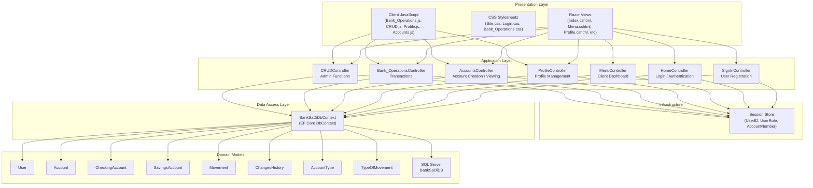
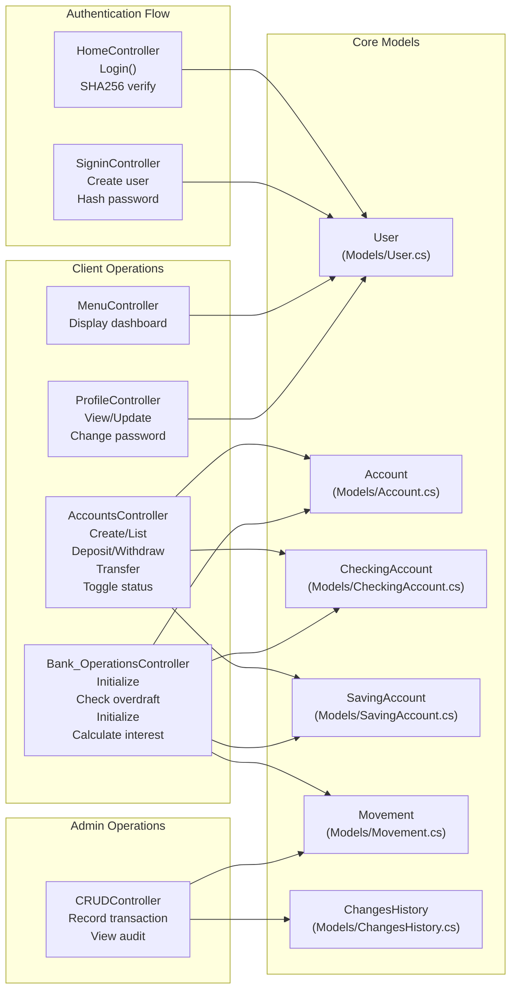

## Propósito y Alcance

Bank-SaDi es un sistema de gestión bancaria basado en la web construido con ASP.NET Core MVC. La aplicación permite a los clientes gestionar cuentas bancarias (corrientes y de ahorro), realizar transacciones (depósitos, retiradas, transferencias) y ver el historial de transacciones. Los administradores pueden gestionar usuarios, controlar el estado de las cuentas y auditar los cambios del sistema a través de un registro de auditoría completo.

El sistema implementa un control de acceso basado en roles con dos tipos de usuarios: usuarios Cliente que gestionan sus propias cuentas y transacciones, y usuarios Administrador que tienen capacidades de gestión a nivel del sistema.

## Pila Tecnológica
La siguiente tabla resume las tecnologías principales utilizadas en Bank-SaDi:


| Layer              | Technology               | Purpose                                              |
|--------------------|---------------------------|------------------------------------------------------|
| **Web Framework**  | ASP.NET Core MVC 6.0+    | Server-side application framework                    |
| **ORM**            | Entity Framework Core     | Database access and object–relational mapping        |
| **Database**       | SQL Server                | Relational data storage (BankSaDiDB)                 |
| **Session Management** | ASP.NET Core Session | In-memory session storage for authentication state   |
| **Authentication** | SHA256 Password Hashing   | Secure password verification                         |
| **Client-Side**    | JavaScript (Vanilla)      | AJAX operations, modal management, dynamic UI        |
| **UI Feedback**    | SweetAlert2               | User-facing success/error notifications              |
| **View Engine**    | Razor                     | Server-side HTML rendering                           |

## Resumen de la Arquitectura del Sistema
Bank-SaDi sigue una arquitectura MVC de tres niveles con una separación clara entre la presentación (Vistas), la lógica de negocio (Controladores) y el acceso a datos (Modelos/DbContext).

## Estructura de Componente de Alto Nivel

## Mapeo de Controladores a Funcionalidades
El siguiente diagrama mapea los controladores a sus responsabilidades principales y a los modelos de dominio con los que interactúan:

## Áreas Funcionales Principales
Bank-SaDi está organizado en cuatro dominios funcionales principales:

### 1. Autenticación y Gestión de Usuarios
   
Implementación: HomeController maneja el inicio de sesión a través de la acción Login()
Controllers/HomeController.cs, Las contraseñas se verifican usando el hash SHA256, Controllers/HomeController.cs

Tras una autenticación exitosa, las credenciales del usuario se almacenan en la sesión mediante HttpContext.Session.SetInt32("UserID", user.UserId) y HttpContext.Session.SetString("UserRole", user.UserType)
Controllers/HomeController.cs


### Clases clave:

* Modelo de usuario con propiedades: UserId, Email, NationalId, PasswordHash, UserType
* HomeController.Login() para autenticación
* SignInController para registro

### 2. Gestión de Cuentas
Implementación: AccountsController gestiona la creación y el listado de cuentas. El sistema soporta dos tipos de cuentas mediante herencia tabla-por-tipo: CheckingAccount con OverDraftLimit Models/BankSaDiDbContext.cs y SavingAccount con InterestRate Models/BankSaDiDbContext.cs

Los números de cuenta se generan de forma programática, y las cuentas se categorizan utilizando la entidad AccountType.

### Clases Clave:

* Entidad base Account
* Entidades especializadas CheckingAccount y SavingAccount
* AccountType para categorización
* AccountsController para operaciones CRUD

## 3. Operaciones Bancarias
Implementación: Bank_OperationsController procesa transacciones financieras. JavaScript del lado del cliente en Bank_Operations.js maneja cuadros de diálogo modales y envíos de formularios mediante AJAX, wwwroot/js/Bank_Operations.js, Las transacciones se registran en la entidad Movement, que vincula cuentas de origen y destino Models/BankSaDiDbContext.cs


### Operaciones Clave:

* Depósitos/Retiro: Actualizar el saldo de la cuenta y crear registros de movimiento
* Transferencias: Validar el estado de la cuenta corriente, verificar la cuenta de destino, actualizar ambos saldos
* Cálculo de Intereses: Aplicar la tasa de interés a los saldos de cuentas de ahorro
* Historial de Transacciones: Consultar movimientos por número de cuenta

### 4. Funciones Administrativas
Implementación: CRUDController proporciona funciones exclusivas para administradores. Los administradores pueden ver todos los clientes, cambiar el estado de la cuenta (activo/inactivo), editar datos de usuarios y ver el historial completo de auditoría a través de la entidad ChangesHistory. Models/BankSaDiDbContext.cs, El modal del historial de cambios se carga dinámicamente mediante AJAX en CRUD.js wwwroot/js/CRUD.js


### Clases Clave:

* CRUDController para todas las acciones de administrador
* ChangesHistory para el historial de auditoría
* Lado del cliente: CRUD.js para la gestión de la interfaz de usuario

## Descripción general del modelo de datos
El esquema de la base de datos garantiza la integridad de los datos mediante claves primarias, claves externas y restricciones de unicidad. La clase BankSaDiDbContext Models/BankSaDiDbContext.cs
configura todas las relaciones de las entidades utilizando la API Fluent de Entity Framework Core.

## Relaciones de Entidades Clave
### Características Principales:

* Restricciones Únicas: Correo Electrónico y IdNacional en Usuario Models/BankSaDiDbContext.cs, Nombre del Tipo en TipoCuenta Models/BankSaDiDbContext.cs
* Herencia: Herencia tipo tabla por tipo para CuentaCorriente y CuentaAhorro
* Registro de Auditoría: ChangesHistory registra todas las modificaciones significativas del sistema
* Grafo de Transacciones: Las entidades Movimiento crean relaciones entre cuentas

## Gestión de Sesiones y Seguridad
Bank-SaDi utiliza el middleware de sesión de ASP.NET Core para la gestión del estado de autenticación. Las sesiones se configuran en Program.cs

* Tiempo de espera: 30 minutos de inactividad
* Almacenamiento: Caché distribuida en memoria
* Configuración de cookies: Solo HTTP, esencial
* 
### Claves de sesión:

* UserID (int): Clave principal del usuario autenticado
* UserRole (string): "Cliente" o "Administrador" para acceso basado en roles
* AccountNumber (int): Cuenta seleccionada actualmente para operaciones bancarias

## Patrones de Interacción Cliente-Servidor
Bank-SaDi implementa tres patrones de interacción distintos:

### Patrón 1: Renderizado del Lado del Servidor (SSR)
Flujo MVC tradicional donde los controladores devuelven vistas Razor completas. Se utiliza para la carga inicial de páginas (inicio de sesión, menú, visualización del perfil).

### Patrón 2: Envíos de Formularios AJAX
Enfoque híbrido donde JavaScript intercepta los envíos de formularios
wwwroot/js/Bank_Operations.js envia datos mediante fetch() con FormData y recibe respuestas JSON. Los controladores detectan AJAX a través del encabezado X-Requested-With: XMLHttpRequest. SweetAlert2 muestra retroalimentación al usuario y luego JavaScript redirige para refrescar la página.

### Patrón 3: Carga Dinámica de Datos
AJAX puro para cargar datos sin refrescar la página, como el modal de historial de cambios
wwwroot/js/CRUD.js que obtiene datos de /CRUD/GetChangesHistory y los renderiza del lado del cliente.

## Configuración de la Aplicación
Conexión a la Base de Datos
La cadena de conexión a la base de datos está configurada en Program.cs

```plaintext
Server=DESKTOP-M8IQAG5SQLEXPRESS;Database=BankSaDiDB;Integrated Security=True;Persist Security Info=False;TrustServerCertificate=True
```

Existe una cadena de conexión alternativa en appsettings.json
appsettings.json pero no está siendo utilizada activamente por la configuración actual.

## Enrutamiento
Patrón de ruta predeterminado: {controller=Home}/{action=Index}/{id?}
Program.cs


## Punto de entrada: 
La aplicación inicia en HomeController.Index(), que muestra la página de inicio de sesión.

## Resumen de la Estructura del Proyecto
```plaintext
Bank-SaDi/
├── Controllers/          # MVC Controllers (7 controllers)
│   ├── HomeController.cs
│   ├── MenuController.cs
│   ├── SignInController.cs
│   ├── ProfileController.cs
│   ├── AccountsController.cs
│   ├── Bank_OperationsController.cs
│   └── CRUDController.cs
│
├── Models/               # Entity Framework Models + DbContext
│   ├── BankSaDiDbContext.cs
│   ├── User.cs
│   ├── Account.cs
│   ├── CheckingAccount.cs
│   ├── SavingAccount.cs
│   ├── Movement.cs
│   ├── ChangesHistory.cs
│   ├── AccountType.cs
│   └── TypeOfMovement.cs
│
├── Views/                # Razor Views (.cshtml)
│   ├── Home/
│   ├── Menu/
│   ├── Profile/
│   ├── Accounts/
│   ├── Bank_Operations/
│   └── CRUD/
│
├── wwwroot/              # Static files (CSS, JS, images)
│   ├── css/              # Stylesheets
│   └── js/               # Client-side JavaScript
│       ├── Bank_Operations.js
│       ├── CRUD.js
│       ├── Profile.js
│       └── Accounts.js
│
├── Program.cs            # Application entry point
└── appsettings.json      # Global configuration file
```


